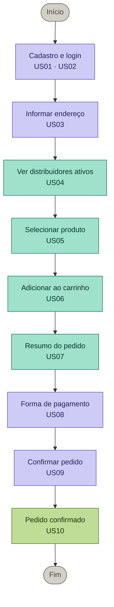

# Banco de Dados — CadêGás MVP

Módulo responsável pela modelagem e criação do banco de dados do projeto CadêGás.

---

## Stack

| Item       | Detalhe              |
|------------|----------------------|
| SGBD       | MySQL 5.7+           |
| Ambiente   | UwAmp (local)        |
| Encoding   | utf8mb4 / unicode_ci |

---

## Arquivos

| Arquivo       | Descrição                              |
|---------------|----------------------------------------|
| `schema.sql`  | Script completo de criação do banco    |
| `README.md`   | Este arquivo                           |

---

## Fluxo do pedido

O diagrama abaixo mostra as etapas que o consumidor percorre desde o cadastro até a confirmação do pedido, e quais User Stories cada etapa atende.



---

## Tabelas criadas

| Tabela          | User Stories atendidas | Descrição                                      |
|-----------------|------------------------|------------------------------------------------|
| `usuario`       | US01, US02, US03       | Consumidores cadastrados no app                |
| `distribuidor`  | US04, US13, US15       | Distribuidores de gás cadastrados pela equipe  |
| `produto`       | US05, US14             | Produtos ofertados por cada distribuidor       |
| `pedido`        | US08, US09, US10       | Pedidos realizados pelos consumidores          |
| `itens_pedido`  | US06, US07             | Itens que compõem cada pedido                  |

---

## Relacionamentos

```
distribuidor ──< produto
usuario      ──< pedido >── distribuidor
pedido       ──< itens_pedido >── produto
```

---

## Como executar

### Via phpMyAdmin (UwAmp)
1. Inicie o UwAmp e acesse `http://localhost/phpmyadmin`
2. Clique em **SQL** no menu superior
3. Cole o conteúdo de `schema.sql`
4. Clique em **Executar**

### Via linha de comando
```bash
mysql -u root -p < schema.sql
```

---

## Status dos pedidos

| Status       | Descrição                                  |
|--------------|--------------------------------------------|
| `pendente`   | Pedido criado — aguarda confirmação        |
| `confirmado` | Distribuidor aceitou o pedido              |
| `em_entrega` | Entregador a caminho                       |
| `entregue`   | Pedido finalizado com sucesso              |
| `cancelado`  | Pedido cancelado                           |

---

## Dados seed incluídos

O script já insere dados iniciais para desenvolvimento:

- 3 distribuidores ativos (Bertioga/SP)
- 7 produtos distribuídos entre os distribuidores
- 1 usuário consumidor de exemplo
- 1 pedido de teste com item vinculado

---

## Responsável

**Amanda Silva Soares** — Módulo: Banco de Dados | Sprint 1   
Disciplina: Desenvolvimento de Sistemas Orientado a Dispositivos Móveis e Baseados na Web
